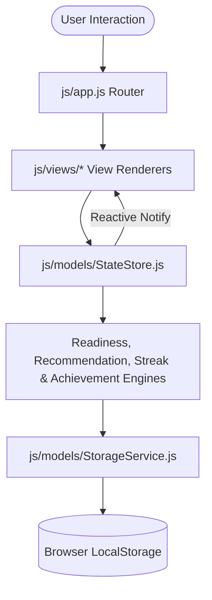

# PlacementOS - Student Career Roadmap & Placement Readiness System

PlacementOS is an enterprise-grade, modern, responsive productivity dashboard for students preparing for campus placements and technical interviews.

Inspired by Notion, Linear, ClickUp, and GitHub Projects, PlacementOS offers a commercial SaaS interface with dark/light mode, reactive state management, custom dynamic SVG/Canvas charts, complete CRUD task & milestone management, and zero backend setup.

---

## 📐 Architecture & Flow Diagram



---

## 📂 Modular Directory Structure

```
placement-roadmap-app/
├── index.html                  # Main SPA Container & ARIA Accessibility Layout
├── README.md                   # Complete Developer & Architecture Documentation
├── css/
│   ├── main.css                # CSS Design System Tokens, Variables & Resets
│   ├── components.css          # Cards, Buttons, Pills, Modals, Toasts & Forms
│   └── pages.css               # Page Layout Rules (Dashboard, Kanban, Roadmap, etc.)
└── js/
    ├── models/
    │   ├── StorageService.js   # LocalStorage Persistence & Backup Validation
    │   ├── StateStore.js       # Reactive Central State Store (Observer Pattern)
    │   ├── Validators.js       # Form Validation (Email, CGPA, Phone, Dates)
    │   ├── ReadinessEngine.js  # Weighted Placement Readiness Calculator
    │   ├── RecommendationEngine.js # Dynamic Rule-Based Action Recommendation Generator
    │   ├── StreakEngine.js     # Daily Activity & Streak Reset Tracker
    │   └── AchievementEngine.js # Automatic Badge Unlock Evaluator
    ├── services/
    │   └── ExportService.js    # PDF, CSV, JSON Export & Import Restore Service
    ├── components/
    │   ├── ChartEngine.js      # Responsive SVG/Canvas Charts (Radar, Line, Bar, Gauge)
    │   ├── UIComponents.js     # Toast System, Modal Manager & Empty States
    │   └── OnboardingWizard.js # First-Time Setup Wizard
    ├── views/
    │   ├── DashboardView.js    # Dynamic KPI & Recommendations Dashboard
    │   ├── ProfileView.js      # Profile View with Inline Form Validation
    │   ├── CareerGoalsView.js  # Role & Company Selector
    │   ├── RoadmapView.js      # Category & Milestone CRUD Accordion View
    │   ├── TaskManagerView.js  # Kanban CRUD, Search, Filter & Sort View
    │   ├── SkillTrackerView.js  # Skill Proficiency Circular Gauge Tracker
    │   ├── PlacementReadinessView.js # Weighted Breakdown & Readiness Status Gauge
    │   ├── AnalyticsView.js    # 365-Day Consistency Heatmap & Growth Charts
    │   ├── HistoryView.js      # Activity Timeline Stream Log
    │   ├── AchievementsView.js # Dynamic Badge Cards & Unlock Progress
    │   ├── ExportView.js       # PDF / CSV / JSON Export & Restore Center
    │   └── SettingsView.js     # System Settings, Dark Mode & Danger Zone Reset
    └── app.js                  # Main Router Controller & Event Delegation
```

---

## 💾 LocalStorage Schema Definition

Key: `PLACEMENT_ROADMAP_STATE_V2`

```json
{
  "theme": "light | dark",
  "user": {
    "name": "Alex Rivera",
    "email": "alex@university.edu",
    "college": "Institute of Technology",
    "gradYear": "2027",
    "cgpa": "8.8",
    "bio": "CS Student",
    "avatar": "AR",
    "targetRole": "Software Engineer",
    "targetCompanies": ["Google", "Microsoft"],
    "onboardingCompleted": true
  },
  "stats": {
    "currentStreak": 12,
    "longestStreak": 24,
    "lastActiveDate": "2026-07-28"
  },
  "roadmap": [
    {
      "id": "cat-prog",
      "category": "Programming",
      "weight": 20,
      "milestones": [
        { "id": "m1", "title": "JavaScript ES6+", "completed": true }
      ]
    }
  ],
  "tasks": [
    {
      "id": "t1",
      "title": "Practice DSA Arrays",
      "category": "DSA",
      "priority": "high",
      "status": "in-progress",
      "deadline": "2026-07-30",
      "progress": 65,
      "estTime": "4h"
    }
  ],
  "achievements": [],
  "history": []
}
```

---

## ⚙️ Installation & Developer Guide

### Running Locally
1. Clone or download the repository directory.
2. Open `index.html` directly in any modern browser (Chrome, Edge, Firefox, Safari) OR serve using a simple HTTP server:
   ```bash
   python -m http.server 3000
   ```
3. Navigate to `http://localhost:3000`.

### Key Features
- **Zero Hardcoded Data**: Works cleanly when LocalStorage is empty by launching the **Onboarding Wizard**.
- **1-Click Demo Data**: Load rich demo data anytime from the Onboarding Screen or Settings page.
- **Dynamic Readiness Engine**: Computes exact weighted placement readiness score based on user categories (`Programming 20%`, `DSA 25%`, `Projects 20%`, `Resume 10%`, `Communication 10%`, `Interview 10%`, `Aptitude 5%`).
- **Complete CRUD**: Perform create, read, update, delete, search, filter, and sort on Tasks, Roadmaps, Profile, and Categories.
- **Export & Backup**: Export printable PDF reports, CSV spreadsheets, and JSON backup files.
